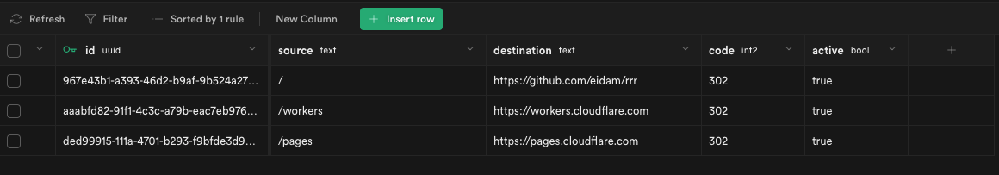

# Supabase to Cloudflare Pages _redirects generator
Simple **Supabase to Cloudflare Pages _redirects generator** example. There are better ways to manage your redirects, but hey, this is fun!



This project is mainly a demonstration of Supabase Function Hooks on data change, combined with Cloudflare Pages Deploy Hooks.

## Setup
1. Deploy this repository to Cloudflare Pages project with `SUPABASE_KEY` and `SUPABASE_URL` build variables _(more info in Cloudflare Pages settings below)_
2. Create Cloudflare Pages Deploy Hook in Project Settings and save it for step 4.
3. Run init SQL to create the `redirects` table _(SQL -> New Query)_
4. Add Supabase Function Hook for table `redirects` on all updates _(Database -> Function Hooks)_
5. Add or edit some redirects in the Supabase Table Editor, all changes should trigger Pages build in the background _(takes ~1 minute to deploy)_

### Init SQL 
```sql
create table public.redirects (
  id                     uuid not null unique primary key default extensions.uuid_generate_v4(),
  source                 text default '/' not null,
  destination            text null,
  code                   int2 not null default 302,
  active                 bool default true not null
);
```

### Cloudflare Pages settings
- build command is `yarn run build`
- build env `SUPABASE_KEY` is the client key _(API -> Authentication)_
- build env `SUPABASE_URL` is your Supabase endpoint, e.g. `https://xxxxyyyy.supabase.co`

### Supabase Function Hook settings
- table `redirects`
- all (Insert, Update, Delete) event
- POST method
- URL is the Cloudflare Pages Deploy Hook

## Examples
- https://redirects.pages.dev
- https://redirects.pages.dev/workers
- https://redirects.pages.dev/pages

## Limitations
- Pages currently allow 100 redirect rules only, so more than 100 rules will be ignored.
- There is no UI apart of the Supabase - it works just fine though.
